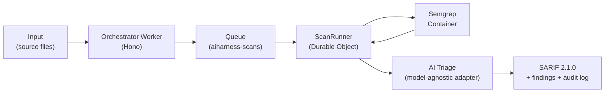
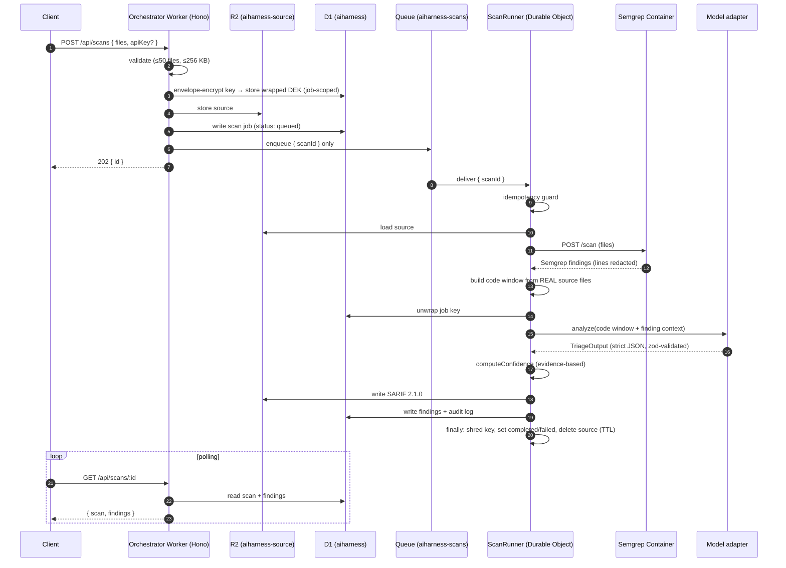

# AIHarness — Architecture

A deep dive into how **AIHarness** scans source code for vulnerabilities: the system spine, each component, the Cloudflare primitives, the design trade-offs, and the hard-won operations gotchas.

> **Built by Vladimir Kamenev for Chevron.** For the high-level overview, quickstart, and API reference, see **[README.md](./README.md)**.

---

## System overview

AIHarness is a **hybrid scanner**: a deterministic SAST floor (Semgrep) combined with an evidence-based LLM triage ceiling, accessed through a swappable model-adapter interface. The system is asynchronous and Cloudflare-native — the request that submits a scan returns immediately with a job ID, and the heavy work happens behind a queue inside a container-enabled Durable Object.



### One scan, end to end



---

## Components

### Orchestrator / routes — `src/index.ts`, `src/orchestrator/`

A **Hono** app running on Cloudflare Workers. It owns the public HTTP surface and the static site (via the `ASSETS` binding). Routes:

| Method & Path | Behavior |
| --- | --- |
| `POST /api/scans` | Validate input + size caps → envelope-encrypt the API key → store source in R2 → write job to D1 → enqueue `{scanId}` → `202 {id}` |
| `GET /api/scans/:id` | `{ scan, findings }` from D1 |
| `GET /api/scans/:id/sarif` | SARIF document from R2 |
| `GET /api/scans/:id/stream` | Durable Object proxy (present, but the UI uses polling) |
| `GET /api/health` | Liveness |

The orchestrator never runs Semgrep or the model itself — it is purely the intake, persistence, and dispatch boundary.

### Queue — `aiharness-scans`

A Cloudflare Queue provides async dispatch from the Worker to the ScanRunner. Two deliberate properties:

- **Messages carry `{scanId}` only** — an R2 pointer. Source code is *never* placed on the queue.
- **`max_retries: 0` (fail-fast by design).** The BYO key is shredded after each attempt, so a retry could not re-run the scan anyway. On failure, `runScan` records a terminal `failed` state rather than looping.

### ScanRunner + Container — `src/scan-runner/runner.ts`

A **container-enabled Durable Object**. It talks to the Semgrep container through the **low-level `this.ctx.container` API** — `getTcpPort(8080).fetch(...)`, started with `enableInternet: true`, behind a readiness retry loop. `runScan(scanId)` does:

1. **Idempotency guard** — ignore duplicate deliveries.
2. **Load source** from R2.
3. **Run the container scan** (`POST /scan`).
4. **Normalize** Semgrep output.
5. **Build the model code window from the ACTUAL source files** — Semgrep redacts matched lines to `"requires login"` for unauthenticated community use, so the runner re-reads the real source for the model window.
6. **Triage** via the model adapter.
7. **Persist** findings + SARIF (R2) + audit (D1).
8. **`finally`** — shred the job key, set `completed` / `failed`, and delete the source (TTL).

#### Scanner Container — `container/Dockerfile`, `container/server.py`

- `Dockerfile` — `FROM semgrep/semgrep`.
- `server.py` — Python stdlib HTTP server on `:8080`:
  - `POST /scan` runs `semgrep --config p/default --json` over the posted files, with a **path-traversal guard** (`realpath` containment), and returns findings.
  - `GET /health`.
- Instance type: **`standard-1`**.

### Model-agnostic adapter — `src/adapters/`

The heart of the "model-agnostic" claim. A single interface:

```ts
interface ModelAdapter {
  id: string;
  capabilities: /* ... */;
  analyze(input): Promise<TriageOutput>;
}
```

- **`ClaudeAdapter`** — model id `claude-opus-4-8`. **No `temperature` parameter** (that model deprecates it and returns HTTP 400). Determinism is anchored by the **pinned model id** plus a **recorded prompt hash** in the audit log — not by temperature.
- **`OpenAIAdapter` / `GeminiAdapter`** — the documented extension point. **Adding a provider = implementing the same interface.** Everything downstream (triage, confidence, SARIF, audit) is provider-agnostic, so a new adapter needs no changes elsewhere.

### Triage engine — `src/triage/`

`triageFindings` orchestrates the per-finding model calls and merges results with the deterministic findings. `computeConfidence` applies the **evidence-based confidence table** — corroboration between the scanner and the model, never the model's self-rating:

| Deterministic | LLM verdict | Confidence |
| --- | --- | --- |
| ✅ flagged | confirmed | **high** |
| ✅ flagged | uncertain | **medium** |
| ✅ flagged | refuted | **low** |
| — (model-only) | — | **low / needs review** |

### Report / SARIF — `src/report/`

- `buildSarif` emits **SARIF 2.1.0 + Errata 01 (OASIS)** with a CWE `taxonomies` block; each `result` carries `partialFingerprints` and `properties` (confidence, verdict, evidence, remediation, cwe). Output is **validated against the official SARIF 2.1.0 JSON Schema in CI (ajv)**.
- `recordAudit` + `hashPrompt` (SHA-256) write an **immutable `audit_log`** to D1.

### Crypto / envelope encryption — `src/crypto/envelope.ts`

AES-GCM **envelope encryption**: a per-job **DEK** (data encryption key) is wrapped by a **KEK** (a Worker secret, used with least-privilege `wrapKey` / `unwrapKey` only). The wrapped ciphertext is stored in D1 scoped to the job and deleted at job end. The plaintext key is **never logged or persisted**.

### D1 schema — `src/db/queries.ts`

Cloudflare D1 tables: **`scans`**, **`findings`**, **`job_keys`**, **`audit_log`**. All queries are **parameterized**.

### Validation — `src/orchestrator/validate.ts`, `src/schema.ts`

zod-based input validation. Caps: **max 50 files**, **max 256 KB total** (UTF-8). `apiKey` is **optional** — if omitted, the server falls back to the `DEMO_ANTHROPIC_KEY` secret so visitors can scan keyless.

### Frontend — `public/`

Static assets served by the Worker's `ASSETS` binding: a light, premium showcase site with an animated 3D architecture diagram and a **Matrix-terminal live demo**. The demo calls the same API; all finding fields render via `textContent` (**XSS-safe**).

---

## Cloudflare primitives

| Primitive | Why it's used |
| --- | --- |
| **Workers + Hono** | Edge HTTP entry, routing, intake, and static-asset serving |
| **Durable Objects + Containers** | Single-owner, stateful scan execution that can host and drive the Semgrep container |
| **Queues** | Async dispatch; decouples fast intake from slow scanning; fail-fast `max_retries: 0` |
| **D1** | Relational store for scans, findings, job keys, and the immutable audit log |
| **R2** | Object store for submitted source (job-scoped TTL) and SARIF reports |
| **Workers static Assets** | Serves the showcase site and demo |
| **Secrets** | `KEK` (key-encryption key) and `DEMO_ANTHROPIC_KEY` (demo fallback) |
| **Custom domain** | `aiharness.degenito.ai` via Worker Custom Domain |

---

## Key design decisions & trade-offs

- **Hybrid, not LLM-only.** Semgrep provides a reproducible, auditable deterministic floor with stable rule IDs; the LLM is the ceiling for context and clarity. Neither alone is trustworthy enough on its own.
- **Evidence-based confidence, not self-rating.** Confidence is derived from corroboration between the deterministic scanner and the model — models are unreliable narrators of their own certainty.
- **Never hard-fail, degrade gracefully.** Model output is zod-validated with a **bounded repair loop (3 attempts)**, then degrades to *uncertain / needs review*. Model-API or container errors mark the scan `failed` instead of crashing.
- **Fail-fast queue.** Because the BYO key is shredded per attempt, a retry can't re-run the scan — so `max_retries: 0` and a terminal `failed` state is the correct, honest behavior.
- **Low-level `ctx.container`, not the `@cloudflare/containers` base class.** The ScanRunner drives the container via `this.ctx.container` directly so that **tests pass and production works** consistently.
- **Test-only wrangler config + vitest workspace.** A `wrangler.test.jsonc` without the `containers` block (the vitest config reader rejects bare Dockerfile paths) keeps the DO binding for runtime tests, while the workspace adds a Node project for the ajv SARIF-schema test.
- **BYO-key envelope encryption.** A per-job DEK wrapped by a least-privilege KEK gives strong, scoped, shreddable key handling without ever persisting plaintext.

---

## Operations / deploy gotchas

These are hard-won; ignore them and a deploy or test run will mysteriously fail.

1. **Docker daemon must be running** for `wrangler deploy` — it builds the Semgrep container image.
2. **`claude-opus-4-8` rejects `temperature`** (HTTP 400) → omit the parameter entirely.
3. **Container needs `enableInternet: true`** so Semgrep can fetch its `p/default` ruleset. Semgrep **redacts matched lines to `"requires login"`** for unauthenticated community use → **build the model code window from the real source files**, not from Semgrep's `lines`.
4. **Cloudflare bot protection `403`s the `Python-urllib` user-agent** → use a browser UA for API tests.
5. **A Worker Custom Domain can exist while its DNS record is missing** → re-attach the binding (`DELETE` + `PUT` `/accounts/{id}/workers/domains`) to re-provision the DNS record.
6. **Tests need `wrangler.test.jsonc`** (no `containers` block) **plus the vitest workspace** (ajv runs in the Node project, not workerd).

---

## Data lifecycle & security

- **Source code** is stored in R2 only for the **job TTL** and **deleted** when the scan ends; it is **never used for model training**.
- **Keys** are **shredded on every path** — `finally` blocks delete the wrapped job key whether the scan completes or fails. Plaintext keys are never logged or persisted.
- **Audit log** (immutable, in D1) records, per scan: the **model id/version**, the **prompt hash** (SHA-256), the **ruleset versions**, and **timestamps** — enough to reconstruct and defend any finding.
- **Defense in depth:** container path-traversal guard (`realpath` containment), prompt-injection defense (code-as-data delimiters + strict-schema output, OWASP LLM01), XSS-safe DOM rendering, parameterized SQL, least-privilege KEK.

> **Roadmap gap (P3):** authN/Z + RBAC + per-tenant isolation are not yet built. The demo endpoint is currently **unauthenticated**, mitigated by unguessable UUIDv4 scan IDs and BYO/demo keys. **Recommend [Cloudflare Access](https://www.cloudflare.com/zero-trust/products/access/) before any sensitive use.**

---

*Built by Vladimir Kamenev for Chevron.*
