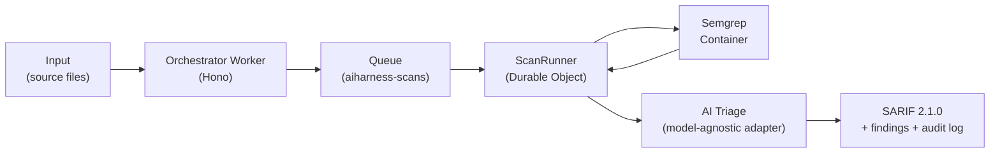

# AIHarness

> **A model-agnostic AI harness for scanning source code for security vulnerabilities.**
> Deterministic SAST (Semgrep) paired with evidence-based LLM triage behind a swappable model-adapter interface — deployed Cloudflare-native.

**Built by Vladimir Kamenev for Chevron.**

[](https://aiharness.degenito.ai)
[](#license)
[](https://docs.oasis-open.org/sarif/sarif/v2.1.0/sarif-v2.1.0.html)
[](https://workers.cloudflare.com/)
[](https://www.typescriptlang.org/)
[](#testing)

---

## Overview

**AIHarness** answers a concrete enterprise vendor-qualification question — *"Have you developed a model-agnostic AI harness for scanning code for vulnerabilities?"* — with a working, deployed system rather than a slide.

It is **hybrid by design**: a **deterministic floor** (Semgrep) provides reproducible, auditable coverage with stable rule IDs, while an **intelligent ceiling** (an LLM, accessed through a swappable adapter) adds context, deduplication, plain-language explanations, remediation guidance, and false-positive suppression. The two layers are combined through **evidence-based confidence** — corroboration between the deterministic scanner and the model, *never* the model's own self-rating.

The result is delivered as **SARIF 2.1.0**, the OASIS standard consumable by GitHub code scanning, IDEs, and enterprise security tooling, alongside an immutable audit trail.

---

## Highlights

- **Model-agnostic adapter** — a single `ModelAdapter` interface (`id`, `capabilities`, `analyze`). Ships with Claude; OpenAI and Gemini are drop-in extension points (implement the same interface). The interface *is* the model-agnostic story.
- **Hybrid, evidence-based confidence** — deterministic + LLM-confirmed → **high**; deterministic + LLM-uncertain → **medium**; deterministic + LLM-refuted → **low**; model-only → **low / needs review**.
- **SARIF 2.1.0 + Errata 01** — CWE taxonomy block, `partialFingerprints`, and rich `properties` (confidence, verdict, evidence, remediation, CWE). Schema-validated in CI.
- **BYO-key envelope encryption** — bring your own model API key; it is AES-GCM envelope-encrypted, scoped to a single job, and **shredded** when the job ends. Or run the **keyless demo** (server demo key).
- **Prompt-injection defense (OWASP LLM01)** — scanned code is passed strictly as *data* inside `BEGIN_CODE_WINDOW` / `END_CODE_WINDOW` delimiters; the system prompt forbids following instructions found in code; the model only fills a strict JSON schema.
- **Never hard-fails** — model output is zod-validated with a bounded repair loop (3 attempts), then degrades to *uncertain / needs review*; API or container errors mark the scan `failed` rather than crashing.
- **Cloudflare-native** — Workers + Hono, Durable Objects + Containers, Queues, D1, R2, static Assets, Secrets, custom domain.
- **XSS-safe demo** — every finding field renders via `textContent`.

---

## Live demo

**[https://aiharness.degenito.ai](https://aiharness.degenito.ai)**

A light, premium showcase site with an animated 3D architecture diagram and a **Matrix-terminal live demo**. The demo is **keyless** — it calls the same public API but omits the `apiKey`, so the server falls back to a `DEMO_ANTHROPIC_KEY` secret. Paste or pick a sample, run a scan, and watch the deterministic + triage pipeline produce findings and SARIF in real time.

---

## Architecture at a glance



The Worker validates and enqueues; the queue carries **only a `scanId`** (an R2 pointer — never source). The ScanRunner loads source from R2, runs the container scan, triages through the adapter, and persists SARIF (R2) + findings + audit (D1).

See **[ARCHITECTURE.md](./ARCHITECTURE.md)** for the deep dive (component-by-component, sequence diagram, design trade-offs, and operations gotchas).

---

## Quickstart

### Prerequisites

- **Node.js** (with `npm`)
- **Docker** — required for deploy (Wrangler builds the Semgrep container image)
- **Cloudflare account** + **Wrangler** CLI
- A model API key for non-demo use (or rely on the demo key locally)

### Develop

```bash
npm install
npm test        # 31 tests (vitest workspace)
npm run dev     # wrangler dev
```

### Deploy

```bash
# 1. Provision Cloudflare resources (D1, R2, Queue) and wire them in wrangler.jsonc
#    - D1 database:  aiharness
#    - R2 bucket:    aiharness-source
#    - Queue:        aiharness-scans

# 2. Set secrets
wrangler secret put KEK                  # envelope key-encryption key
wrangler secret put DEMO_ANTHROPIC_KEY   # keyless-demo fallback key

# 3. Apply migrations to the remote D1
npm run migrate:remote

# 4. Deploy  (Docker daemon MUST be running — it builds the Semgrep image)
npm run deploy
```

> **Heads up:** `npm run deploy` fails if Docker is not running, because it builds the `semgrep/semgrep`-based container image. See [ARCHITECTURE.md → Operations](./ARCHITECTURE.md#operations--deploy-gotchas).

---

## Using the API

### `POST /api/scans` — submit a scan

`apiKey` is **optional**. Omit it to use the server demo key.

```bash
curl -X POST https://aiharness.degenito.ai/api/scans \
  -H "Content-Type: application/json" \
  -H "User-Agent: Mozilla/5.0" \
  -d '{
    "files": [
      { "path": "app.py", "content": "import os\nos.system(request.args.get(\"cmd\"))" }
    ]
  }'
```

> **Note:** Cloudflare bot protection rejects the default `Python-urllib` user-agent with `403`. Use a browser UA when testing.

**Response** (`202 Accepted`):

```json
{ "id": "8f3c1e2a-7b6d-4c5e-9a0f-1d2e3f4a5b6c" }
```

Caps: **max 50 files**, **max 256 KB total** (UTF-8). To bring your own key, include `"apiKey": "sk-..."` in the body — it is envelope-encrypted and shredded after the job.

### `GET /api/scans/:id` — fetch status + findings

```json
{
  "scan": { "id": "8f3c1e2a-...", "status": "completed" },
  "findings": [
    {
      "cwe": "CWE-78",
      "severity": "high",
      "confidence": "high",
      "verdict": "confirmed",
      "file": "app.py",
      "startLine": 2,
      "explanation": "User-controlled input flows into os.system, enabling OS command injection.",
      "remediation": "Avoid shell execution of untrusted input; use subprocess with an argument list and strict allow-listing."
    }
  ]
}
```

### `GET /api/scans/:id/sarif` — SARIF 2.1.0 report

Returns the full **SARIF 2.1.0 + Errata 01** document from R2 (CWE taxonomy, `partialFingerprints`, confidence/verdict/evidence/remediation `properties`).

### `GET /api/health` — liveness probe

| Method & Path | Purpose |
| --- | --- |
| `POST /api/scans` | Validate, envelope-encrypt key, store source in R2, enqueue → `202 {id}` |
| `GET /api/scans/:id` | `{ scan, findings }` |
| `GET /api/scans/:id/sarif` | SARIF 2.1.0 document from R2 |
| `GET /api/scans/:id/stream` | Durable Object proxy (the UI uses polling) |
| `GET /api/health` | Liveness |

---

## Standards & best practices

AIHarness is deliberately aligned to recognized security and AI-governance standards, layer by layer.

| Layer | Standards & references |
| --- | --- |
| **Vulnerability taxonomy** | [CWE](https://cwe.mitre.org/) · [CWE Top 25 (2024)](https://cwe.mitre.org/top25/archive/2024/2024_cwe_top25.html) · [MITRE ATT&CK](https://attack.mitre.org/) · [CAPEC](https://capec.mitre.org/) |
| **Application security** | [OWASP Top 10 (2021)](https://owasp.org/Top10/) · [OWASP ASVS 5.0](https://owasp.org/www-project-application-security-verification-standard/) · [OWASP Top 10 for LLM Apps (2025)](https://genai.owasp.org/llm-top-10/) |
| **Findings interchange** | [SARIF 2.1.0 (OASIS)](https://docs.oasis-open.org/sarif/sarif/v2.1.0/sarif-v2.1.0.html) |
| **Secure development** | [NIST SSDF SP 800-218](https://csrc.nist.gov/pubs/sp/800/218/final) · [SP 800-218A (AI)](https://csrc.nist.gov/pubs/sp/800/218/a/final) |
| **AI risk management** | [NIST AI RMF (AI 100-1)](https://www.nist.gov/itl/ai-risk-management-framework) · [Gen-AI Profile (NIST AI 600-1)](https://www.nist.gov/publications/artificial-intelligence-risk-management-framework-generative-artificial-intelligence) |
| **Cyber governance** | [NIST CSF 2.0](https://www.nist.gov/cyberframework) |
| **Supply chain** | [SLSA v1.0](https://slsa.dev/) · [CycloneDX SBOM](https://cyclonedx.org/) · [CISA SBOM](https://www.cisa.gov/sbom) |
| **Management systems** | [ISO/IEC 27001](https://www.iso.org/standard/27001) · [ISO/IEC 42001:2023](https://www.iso.org/standard/42001) · [SOC 2](https://www.aicpa-cima.com/topic/audit-assurance/audit-and-assurance-greater-than-soc-2) |
| **Industrial / code quality** | [ISA/IEC 62443](https://www.isa.org/standards-and-publications/isa-standards/isa-iec-62443-series-of-standards) · [ISO/IEC 5055](https://www.iso.org/standard/80623.html) |

> **Footnote:** Executive Order 14110 was **revoked 2025-01-20**. AIHarness aligns to SSDF and the AI RMF on technical merit, independent of that EO.

---

## Security

- **BYO-key, shredded** — keys are AES-GCM envelope-encrypted, scoped to one job, and deleted on every exit path.
- **Prompt-injection defense** — code-as-data delimiters + strict-schema output (OWASP LLM01).
- **Evidence-based confidence** — corroboration, not model self-rating.
- **Defense in depth** — container path-traversal guard, XSS-safe DOM rendering, parameterized SQL, least-privilege KEK.
- **Self-scan (2026-06-24):** **0 production-dependency vulnerabilities**; SARIF output **validated against the official 2.1.0 schema in CI**; **CycloneDX SBOM** (148 components); manual review clean.

> **Honest caveat:** authN/Z + RBAC + per-tenant isolation is a **roadmap item (P3)**. The demo endpoint is currently **unauthenticated**, mitigated by unguessable UUIDv4 scan IDs and BYO/demo keys. **Place [Cloudflare Access](https://www.cloudflare.com/zero-trust/products/access/) in front of any sensitive use.**

See **[SECURITY.md](./SECURITY.md)** for the full posture.

---

## Testing

```bash
npm test            # 31 tests
npx tsc --noEmit    # type-check (src is clean)
```

Tests run as a **Vitest workspace** with two projects:

- a **workerd pool** project (`@cloudflare/vitest-pool-workers`) for Worker/runtime code, and
- a **Node** project for the **ajv SARIF-schema** test (ajv is CommonJS and cannot load in workerd).

Tests use `wrangler.test.jsonc` — a test config *without* the `containers` block (the vitest config reader rejects bare Dockerfile paths), while keeping the Durable Object binding so the runtime tests still work.

---

## Project structure

```
aiharness/
├── src/
│   ├── index.ts            # Worker entry (Hono app + ASSETS)
│   ├── types.ts
│   ├── schema.ts           # zod schemas
│   ├── orchestrator/       # routes + validate.ts
│   ├── scan-runner/        # runner.ts (container-enabled Durable Object)
│   ├── adapters/           # ModelAdapter interface + ClaudeAdapter (+ OpenAI/Gemini stubs)
│   ├── triage/             # triageFindings + computeConfidence
│   ├── report/             # buildSarif + recordAudit + hashPrompt
│   ├── crypto/             # envelope.ts (AES-GCM envelope encryption)
│   └── db/                 # queries.ts (D1)
├── container/
│   ├── Dockerfile          # FROM semgrep/semgrep
│   └── server.py           # stdlib HTTP server on :8080
├── migrations/             # D1 migrations
├── public/                 # static showcase site + live demo
├── tests/
├── fixtures/               # incl. vuln-sample/ (intentional planted-vuln corpus)
├── docs/                   # specs, plans, security/self-scan, site reports
├── wrangler.jsonc          # production config
├── wrangler.test.jsonc     # test config (no containers block)
├── vitest.config.ts        # workers pool
├── vitest.node.config.ts   # node (schema test)
└── vitest.workspace.ts     # both projects
```

---

## Roadmap

| Phase | Status | Scope |
| --- | --- | --- |
| **P1a** | ✅ Done (deployed) | Orchestrator + ScanRunner (DO + Container, Semgrep) + Claude adapter + envelope key vault + SARIF 2.1.0 + demo site |
| **P1b** | Planned | Secret scanning + dependency/SCA (OSV) + CycloneDX SBOM in the container; result caching |
| **P2** | Planned | OpenAI + Gemini adapters + selector + adversarial self-verify |
| **P3** | Planned | GitHub Action + PR webhook bot + public REST API + RBAC/auth + per-tenant isolation + diff/baseline/suppression |
| **P4** | Planned | Published benchmark (precision/recall), policy/compliance profiles (ASVS L2, IEC 62443, CWE Top 25), private/air-gap model option, prompt-injection test suite |

---

## Author & contact

**Built by Vladimir Kamenev for Chevron.**
Contact: **5123369618** · burademirung@gmail.com

Live: [https://aiharness.degenito.ai](https://aiharness.degenito.ai)

## License

**MIT** © 2026 Vladimir Kamenev
